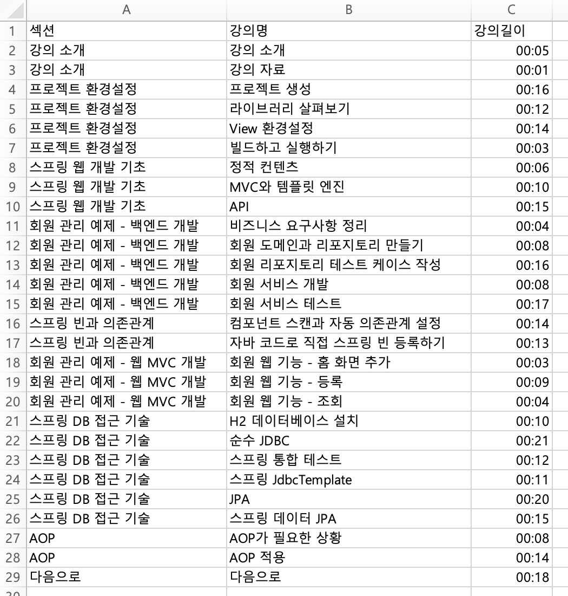
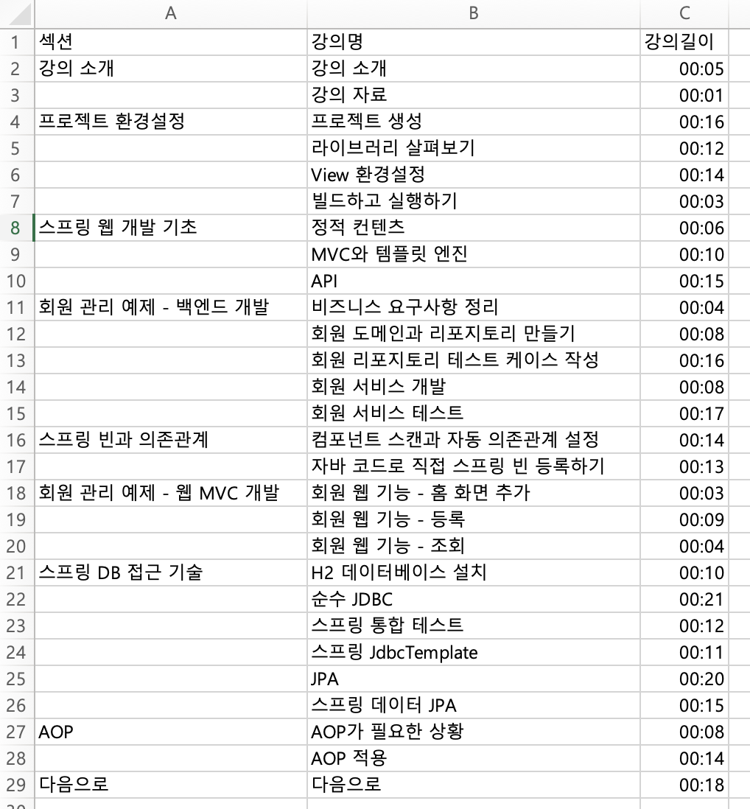

# inflearn_curriculum_formatter
인프런 강의 목차를 CSV 파일 형태로 저장한다.

## Example
- URL example : https://www.inflearn.com/course/스프링-입문-스프링부트/lecture/49593?tab=curriculum  
- 기본 옵션

  
- one-section-name


# Manual
```shell
python inflearn.py URL [option]
```

## Parameter
- URL : 인프런의 강의 목차를 가져올 주소
- --one-section-name : 섹션당 하나의 섹션명을 입력한다.

# Requirements
- python3
- bs4
- requests
